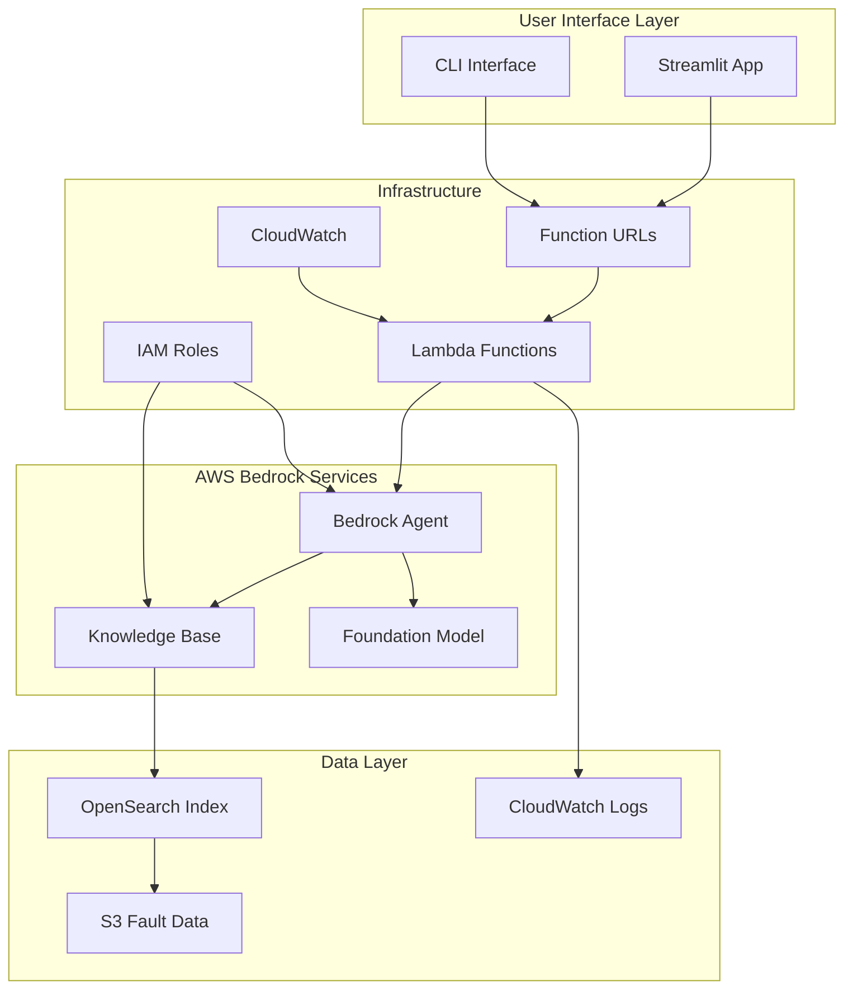

# Design Document

## Overview

The Bedrock Agent system is designed as an intelligent maintenance expert that leverages AWS Bedrock's capabilities to provide natural language access to historical equipment fault data. The system consists of a Knowledge Base for semantic search over S3-stored fault prediction data, an Agent for intelligent query processing, and supporting infrastructure for real-time interactions.

The architecture follows a serverless, event-driven design that integrates seamlessly with existing equipment monitoring infrastructure while providing scalable, secure access to maintenance insights.

## Architecture

### High-Level Architecture



### Component Architecture

The system is built around three core components:

1. **Bedrock Knowledge Base**: Indexes historical fault data from S3 using OpenSearch for semantic search
2. **Bedrock Agent**: Orchestrates queries, processes natural language, and generates responses
3. **API Layer**: Provides secure, scalable access through REST endpoints and WebSocket connections

## Components and Interfaces

### 1. Knowledge Base Component

**Purpose**: Semantic indexing and retrieval of historical fault prediction data

**Key Features**:
- Automatic synchronization with S3 data sources
- Vector embeddings for semantic search
- Metadata filtering for temporal and categorical queries
- Real-time index updates

**Interfaces**:
```typescript
interface KnowledgeBaseConfig {
  name: string;
  description: string;
  roleArn: string;
  dataSource: {
    s3Configuration: {
      bucketArn: string;
      inclusionPrefixes: string[];
    };
    chunkingStrategy: ChunkingStrategy;
  };
  vectorIngestionConfiguration: {
    chunkingConfiguration: ChunkingConfiguration;
  };
}

interface QueryRequest {
  query: string;
  retrievalConfiguration: {
    vectorSearchConfiguration: {
      numberOfResults: number;
      overrideSearchType?: 'HYBRID' | 'SEMANTIC';
    };
  };
  filter?: MetadataFilter;
}
```

### 2. Bedrock Agent Component

**Purpose**: Natural language processing and intelligent response generation

**Key Features**:
- Multi-turn conversation support
- Context-aware query processing
- Integration with Knowledge Base for data retrieval
- Structured response formatting

**Interfaces**:
```typescript
interface AgentConfig {
  agentName: string;
  description: string;
  foundationModel: string;
  instruction: string;
  knowledgeBases: KnowledgeBaseAssociation[];
  actionGroups?: ActionGroup[];
}

interface ConversationRequest {
  sessionId: string;
  inputText: string;
  sessionState?: SessionState;
}

interface ConversationResponse {
  sessionId: string;
  response: string;
  citations?: Citation[];
  sessionState: SessionState;
  trace?: AgentTrace;
}
```

### 3. Lambda Function URLs

**Purpose**: Direct HTTPS endpoints for Lambda functions, eliminating API Gateway complexity

**Key Features**:
- Direct Lambda invocation via HTTPS
- Built-in CORS support for Streamlit integration
- IAM-based authentication or public access
- Simplified deployment and configuration
- Cost-effective for direct function access

**Function URLs**:
```
POST https://{unique-id}.lambda-url.{region}.on.aws/ (query-handler)
GET https://{unique-id}.lambda-url.{region}.on.aws/ (session-manager)
DELETE https://{unique-id}.lambda-url.{region}.on.aws/ (session-manager)
GET https://{unique-id}.lambda-url.{region}.on.aws/ (health-check)
```

**Configuration**:
- CORS enabled for Streamlit domain
- IAM authentication for secure access
- Request/response payload format optimized for HTTP

### 4. Streamlit Web Interface

**Purpose**: Interactive web application for maintenance team interactions

**Key Features**:
- Chat-based interface for natural language queries
- Real-time response streaming
- Session management and conversation history
- Data visualization for fault patterns and trends
- Equipment selection and filtering controls

**Components**:
- Main chat interface with conversation history
- Sidebar for equipment filtering and time range selection
- Metrics dashboard for system health and usage
- Export functionality for reports and analysis

### 5. Lambda Functions

**Purpose**: Serverless compute with direct HTTPS access via Function URLs

**Functions**:
- `query-handler`: Processes incoming queries and manages agent interactions (Function URL enabled)
- `session-manager`: Handles conversation session lifecycle (Function URL enabled)
- `data-sync`: Manages Knowledge Base synchronization with S3 (EventBridge triggered)
- `health-check`: System health monitoring endpoint (Function URL enabled)

**Function URL Configuration**:
```python
# Example Function URL configuration
{
    "AuthType": "AWS_IAM",  # or "NONE" for public access
    "Cors": {
        "AllowCredentials": True,
        "AllowHeaders": ["content-type", "authorization"],
        "AllowMethods": ["GET", "POST", "DELETE"],
        "AllowOrigins": ["https://your-streamlit-app.com"],
        "MaxAge": 86400
    },
    "InvokeMode": "BUFFERED"  # or "RESPONSE_STREAM" for streaming
}
```

## Data Models

### Fault Data Schema

Historical fault prediction data stored in S3 follows this structure:

```json
{
  "timestamp": "2024-01-15T10:30:00Z",
  "equipment_id": "PUMP_001",
  "sensor_readings": {
    "temperature": 85.2,
    "vibration": 2.1,
    "pressure": 150.5,
    "flow_rate": 45.8
  },
  "fault_prediction": {
    "fault_type": "bearing_wear",
    "probability": 0.85,
    "risk_level": "high",
    "time_to_failure": "72_hours"
  },
  "maintenance_context": {
    "last_maintenance": "2024-01-01T08:00:00Z",
    "maintenance_type": "routine_inspection",
    "next_scheduled": "2024-02-01T08:00:00Z"
  },
  "metadata": {
    "location": "Building_A_Floor_2",
    "criticality": "high",
    "operating_mode": "continuous"
  }
}
```

### Session State Schema

Conversation sessions maintain context using this structure:

```json
{
  "sessionId": "uuid",
  "userId": "user_identifier",
  "createdAt": "timestamp",
  "lastActivity": "timestamp",
  "conversationHistory": [
    {
      "role": "user|assistant",
      "content": "message_content",
      "timestamp": "timestamp",
      "citations": ["source_references"]
    }
  ],
  "context": {
    "currentEquipment": ["equipment_ids"],
    "timeRange": {
      "start": "timestamp",
      "end": "timestamp"
    },
    "focusAreas": ["fault_types", "maintenance_topics"]
  }
}
```

## Error Handling

### Error Categories

1. **User Input Errors**
   - Invalid query format
   - Unsupported time ranges
   - Missing required parameters

2. **System Errors**
   - Bedrock service unavailability
   - Knowledge Base sync failures
   - Lambda timeout errors

3. **Data Errors**
   - Missing or corrupted fault data
   - Index synchronization issues
   - S3 access permissions

### Error Response Strategy

```typescript
interface ErrorResponse {
  error: {
    code: string;
    message: string;
    details?: any;
    timestamp: string;
    requestId: string;
  };
  fallback?: {
    suggestion: string;
    alternativeActions: string[];
  };
}
```

### Retry and Fallback Logic

- **Transient Errors**: Exponential backoff with jitter (max 3 retries)
- **Service Unavailability**: Graceful degradation with cached responses
- **Data Access Issues**: Alternative data sources or historical averages
- **Timeout Handling**: Partial results with continuation tokens

## Testing Strategy

### Unit Testing

**Knowledge Base Tests**:
- Data ingestion and indexing accuracy
- Query processing and filtering
- Metadata extraction and validation
- Synchronization logic

**Agent Tests**:
- Natural language understanding
- Response generation quality
- Context maintenance across conversations
- Citation accuracy and relevance

**Function URL Tests**:
- Direct Lambda invocation via HTTPS
- CORS configuration and preflight requests
- IAM authentication and authorization
- HTTP request/response format validation
- Error handling and status codes

### Integration Testing

**End-to-End Workflows**:
- Complete query processing pipeline
- Multi-turn conversation flows
- Data synchronization processes
- Error recovery scenarios

**Performance Testing**:
- Concurrent user load testing
- Query response time benchmarks
- Knowledge Base scaling limits
- Memory and compute optimization

### Test Data Strategy

**Synthetic Data Generation**:
- Representative fault scenarios
- Varied sensor reading patterns
- Different equipment types and configurations
- Historical maintenance records

**Test Environment**:
- Isolated AWS account for testing
- Reduced-scale Knowledge Base
- Mock external dependencies
- Automated test data refresh

### Monitoring and Validation

**Quality Metrics**:
- Response accuracy and relevance
- Citation correctness
- Query processing time
- User satisfaction indicators

**System Health Checks**:
- Service availability monitoring
- Data freshness validation
- Performance threshold alerts
- Security compliance verification

## Security Considerations

### Access Control

- IAM roles with least-privilege permissions
- Resource-based policies for cross-service access
- API Gateway authentication integration
- Session-based access control

### Data Protection

- Encryption in transit (TLS 1.3)
- Encryption at rest (S3, OpenSearch)
- Secure credential management (AWS Secrets Manager)
- Data retention and purging policies

### Compliance

- Audit logging for all data access
- Compliance with organizational security policies
- Regular security assessments
- Incident response procedures

## Deployment Architecture

### Infrastructure as Code

- CloudFormation templates for AWS resources
- CDK constructs for complex configurations
- Environment-specific parameter management
- Automated deployment pipelines

### Streamlit Application Deployment

**Hosting Options**:
- **Option 1**: Streamlit Cloud for rapid deployment and prototyping
- **Option 2**: AWS ECS/Fargate for production deployment with full control
- **Option 3**: EC2 instance with Docker containerization

**Configuration**:
- Environment variables for API endpoints and AWS credentials
- Secrets management for sensitive configuration
- Health checks and auto-restart capabilities
- Load balancing for high availability (production)

### Environment Strategy

- **Development**: Local Streamlit development server with test API
- **Staging**: Streamlit Cloud deployment with staging API endpoints
- **Production**: ECS/Fargate deployment with production API and monitoring

### Monitoring and Observability

- CloudWatch metrics and alarms
- X-Ray tracing for request flow analysis
- Custom dashboards for system health
- Automated alerting for critical issues